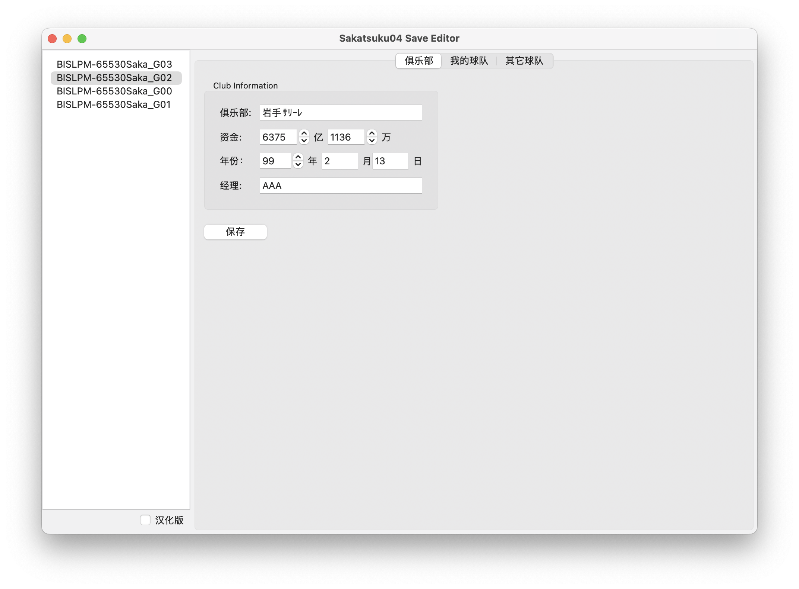
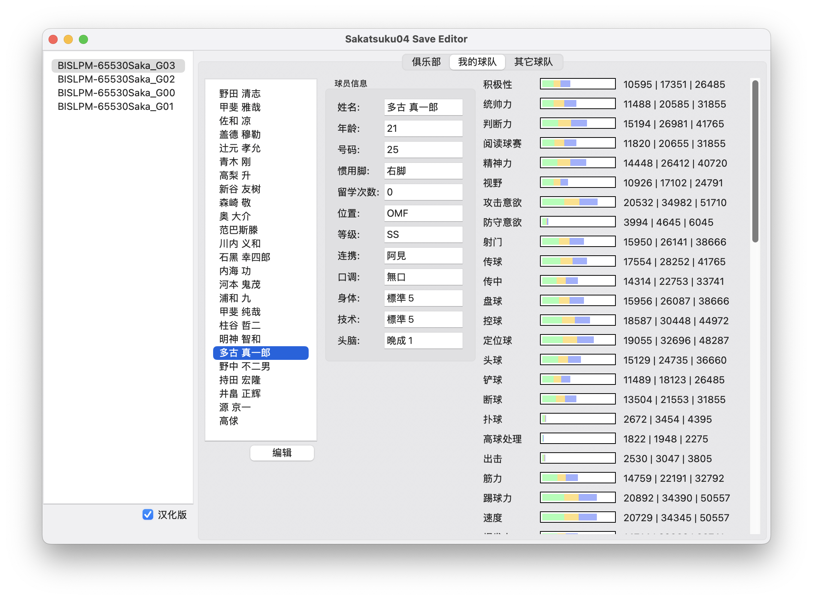
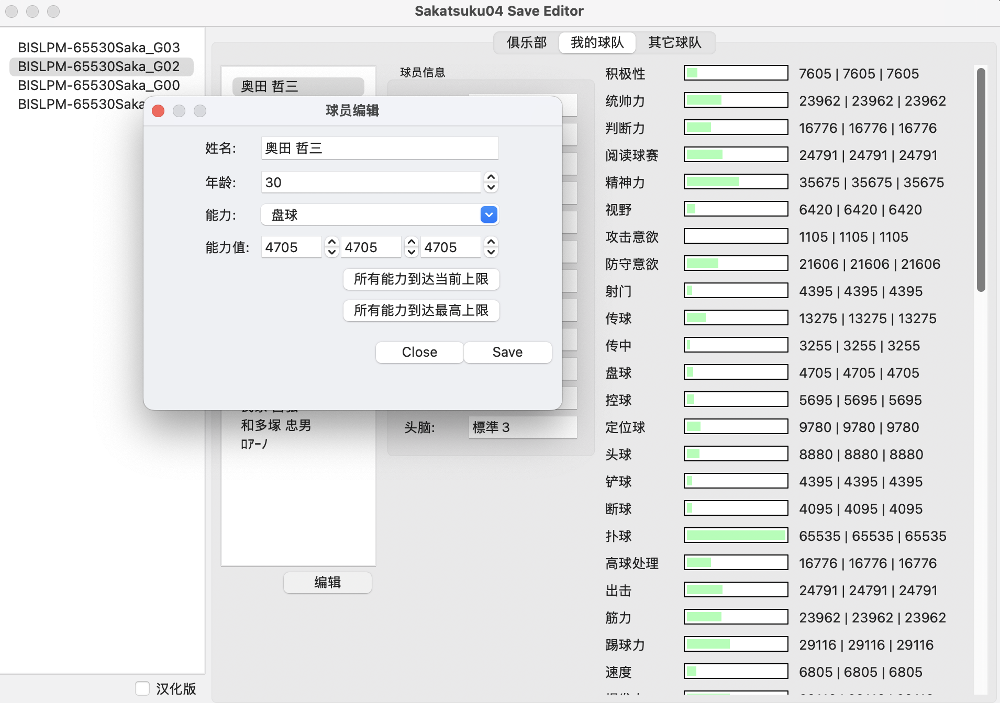
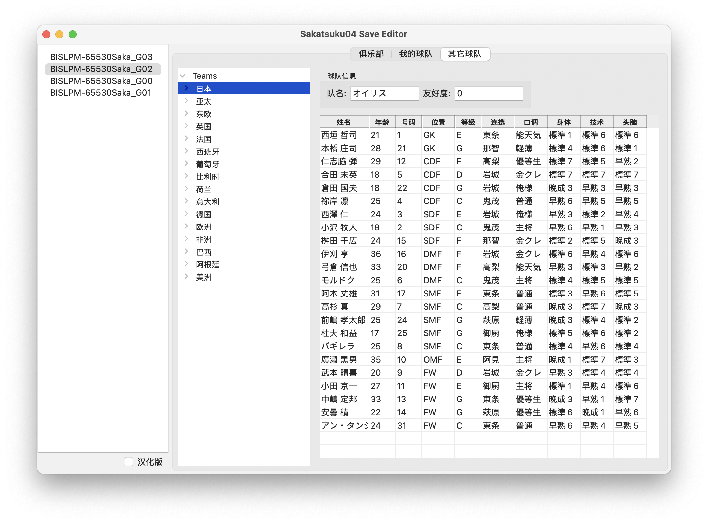

# Sakatsuku04

Opensource game and save editor for J.League Pro Soccer Club o Tsukurou! 04 (PS2).

## Features

Currently supported viewing features:  

- Club information
  - Club name
  - Funds
  - Game year, month, date
  - Manager name
- My Team information
  - Player basic information (name, age, rank, growth types, teamwork types, tone types)
  - Player abilities
- Other team information
  - Team players (name, age, rank, growth types, teamwork types, tone types)

Currently supported editing features:

- Club information
  - Funds
  - Game year
- My Team information
  - Player age
  - Player abilities

## Screenshots

## Hacker notes

[Save File Format Analysis](docs/save_file_format_analysis.md)