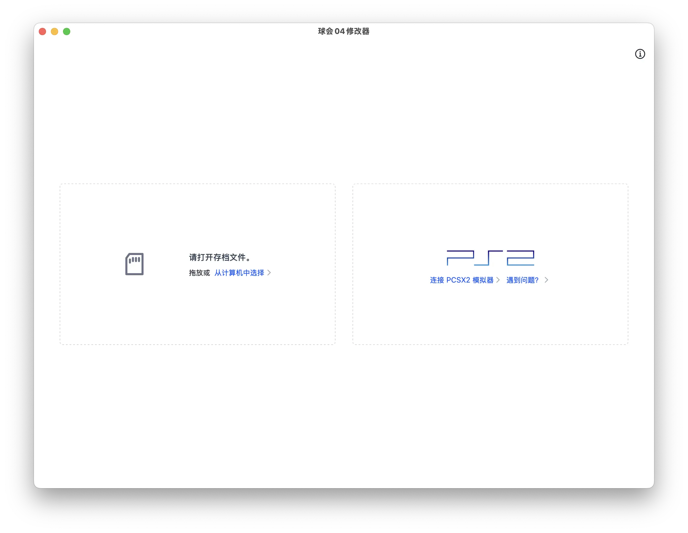
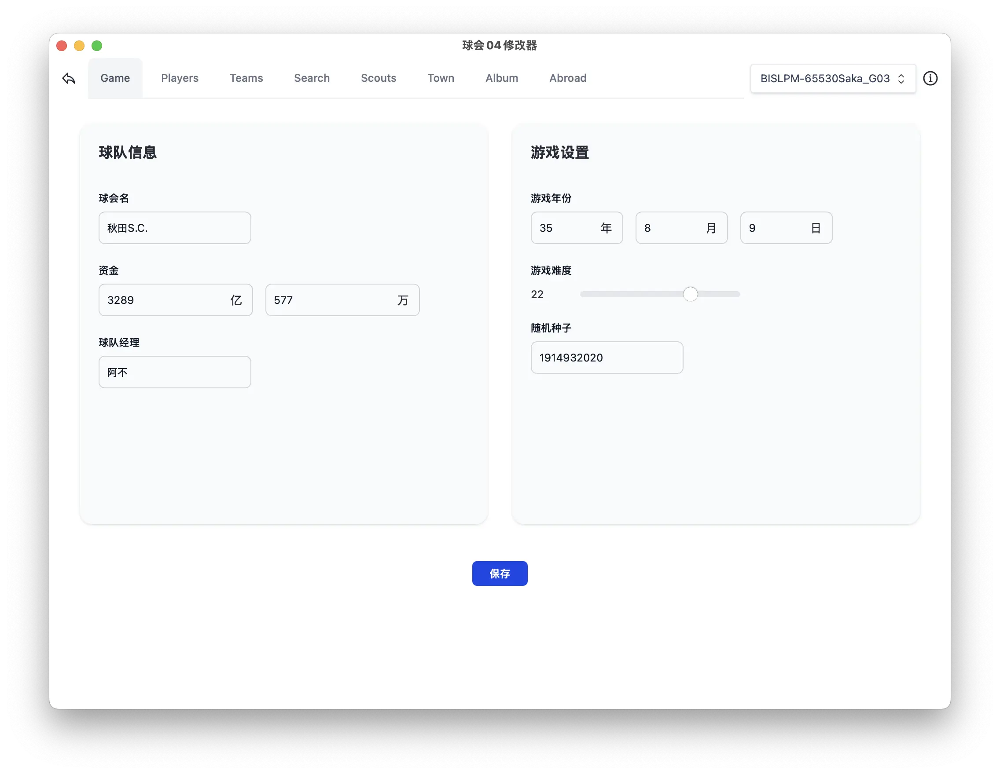
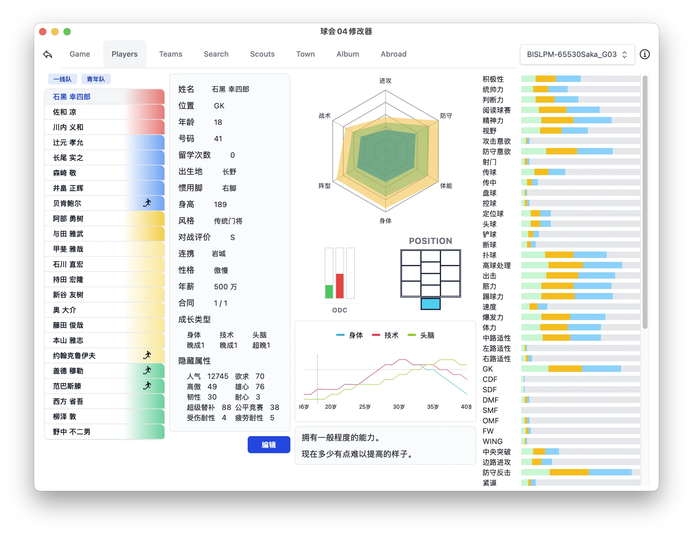
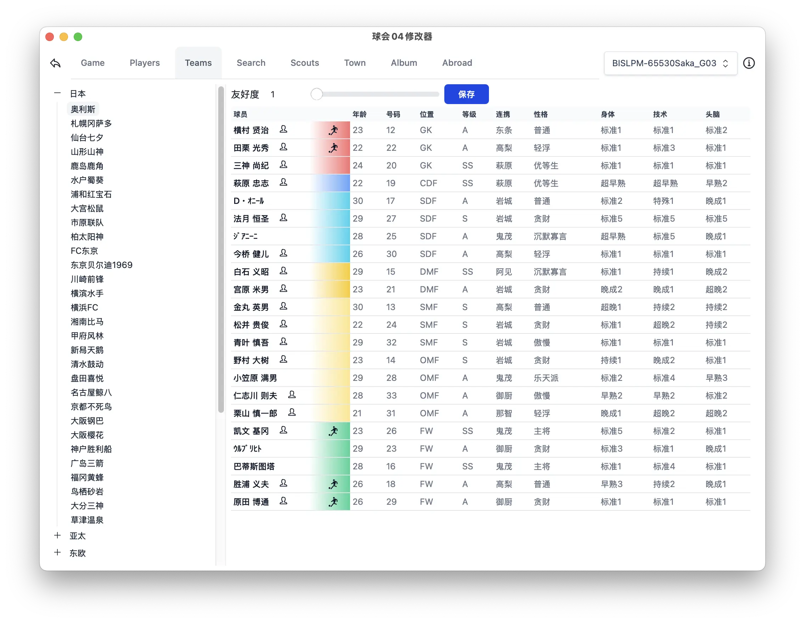
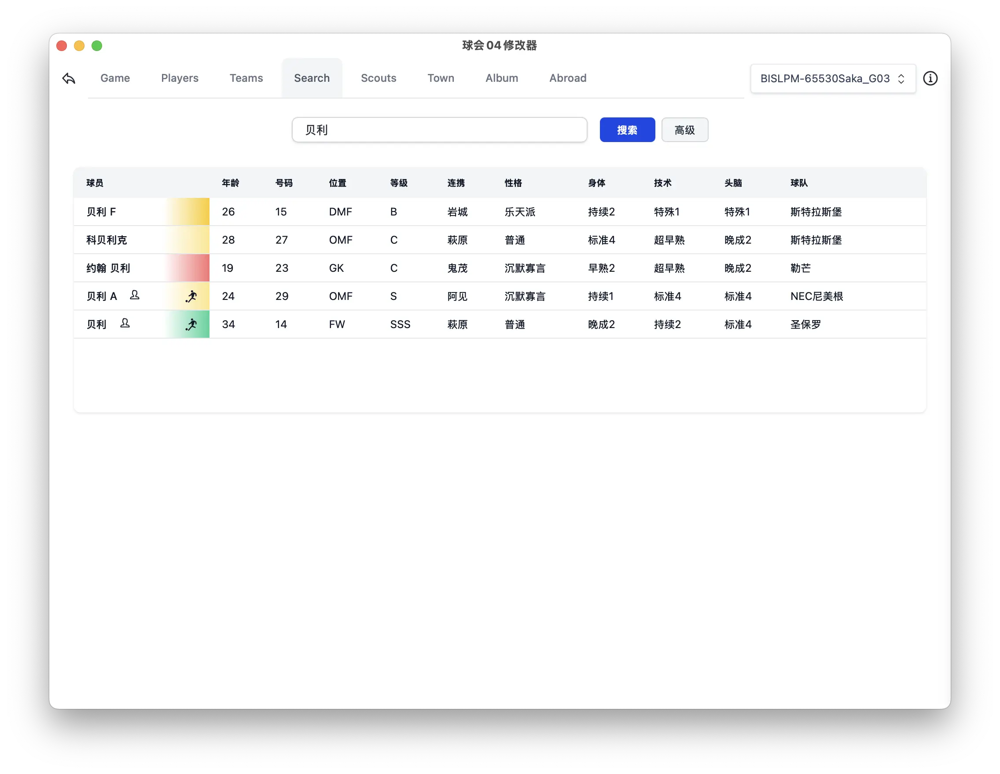
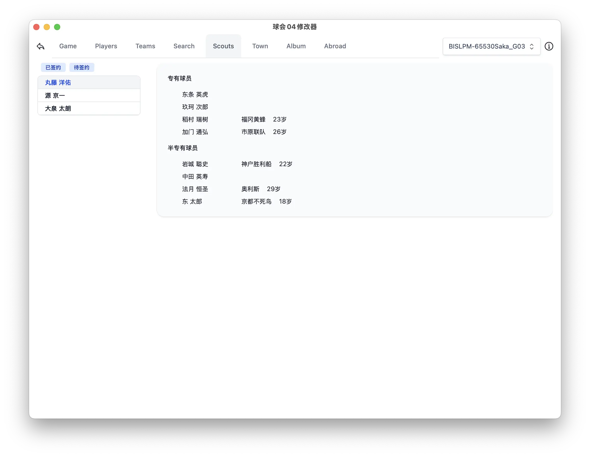
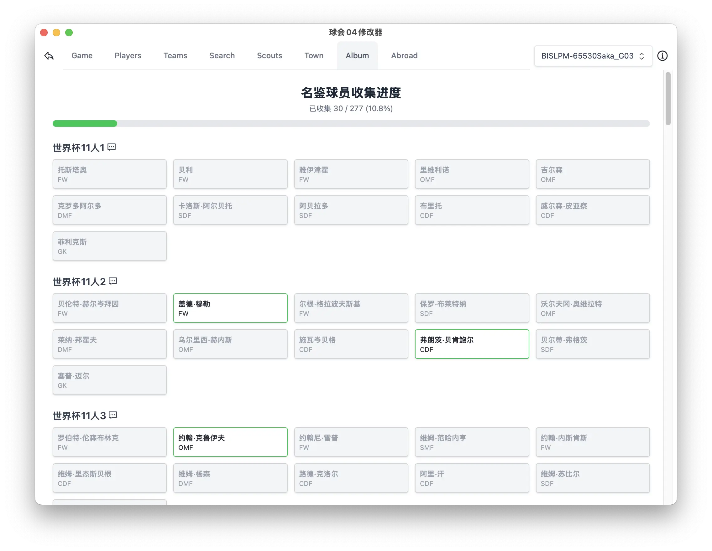
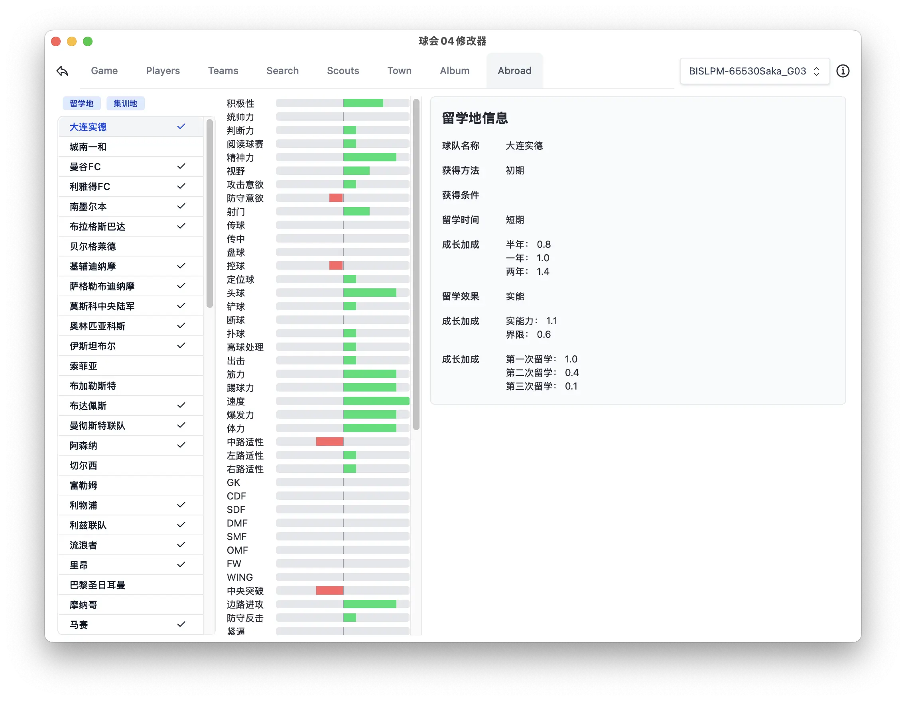

# Sakatsuku04 Editor

[](https://yuzhi.tech/docs/saka04/download)
[]([./docs/INSTALL.md](https://yuzhi.tech/docs/saka04/download))
[](https://yuzhi.tech/docs/saka04)
[](https://github.com/caol64/sakatsuku04)
[](LICENSE)
[](https://github.com/caol64/sakatsuku04)

An open-source game and save editor for **J.League Pro Soccer Club o Tsukurou! 04** (PS2).


## 🚀 Quick Start

The recommended way to run `Saka04Editor` is by using [`uv`](https://github.com/astral-sh/uv) to create and manage a virtual environment:

```bash
uv venv --python python3.13
uv pip install Saka04Editor
uv run Saka04Editor
```

Alternatively, you can download the latest prebuilt releases from the official site:

👉 [https://yuzhi.tech/docs/saka04/download](https://yuzhi.tech/docs/saka04/download)

## ✨ Features

Currently, the editor supports two modes:

### 🗃 Save File Editing

* Open and modify memory card save files.
* Supports full in-game data editing (players, teams, etc.).

### ⚡ Real-Time Editing (PCSX2)

* Modify game data in real time while connected to a running PCSX2 emulator.
* Offers the same editing capabilities as save file mode — now live while the game is running.

## 📸 Screenshots

### 🔧 Mode Selection

Choose between **Save File Editing** or **Real-Time Editing**.



---

### ⚙️ General Game Data Editing

Edit key gameplay information such as club funding, game date, and more.



---

### 🧑‍✈️ Player Editor

View and modify detailed attributes of players, including abilities, skills, contracts, and positions...



---

### 🏆 View Other Teams

Browse data from all other clubs on the world.



---

### 🔍 Player Search

Search across all known players using filters like name, position, or rank.



---

### 🕵️ Scout Overview

Displays each scout’s exclusive and semi-exclusive players, along with their current club and age information.



---

### 🏘 Edit Hometown Database

Customize hometown data.


---

### 📖 Player Encyclopedia Progress

Track your collection progress for encyclopedia (名鉴) players.



---

### ✈️ Abroad Training / Camp Locations

View and modify available abroad training and camp destinations.



## Hacker notes

[Save File Format Analysis](docs/save_file_format_analysis.md)

## Acknowledgements

The data used in this project was obtained from \[サカつく04緑本追補] and \[サカつく04データ置き場]. I am grateful for their contribution to making this information publicly available.

## References

* [サカつく04緑本追補](https://sites.google.com/view/sakatsuku04/home)
* [サカつく04データ置き場](https://www.potato.ne.jp/ando/sakatuku/index.html)
